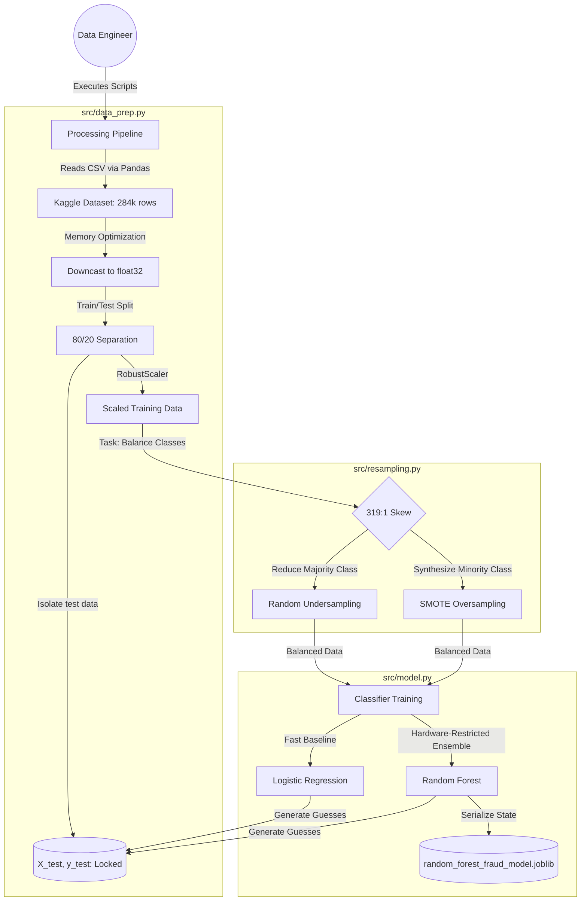

# Credit Card Fraud Detection: Resampling & Processing Engine
> *This repository is currently under active development. Data ingestion, resampling pipelines, and baseline machine learning classifications are complete. Currently staging for hyperparameter tuning and model evaluation.*

A modular, memory-efficient Python pipeline engineered to process and balance highly skewed financial datasets. Designed specifically for low-resource hardware constraints, this project implements robust data ingestion, feature scaling, advanced algorithmic resampling (SMOTE), and baseline classification to detect fraudulent credit card transactions.

---
## 📅 Project Roadmap
This project is being built progressively to ensure high code quality and mathematical rigor at each step.

* [x] **Day 1: System Architecture & Ingestion** — Structuring the repository, optimizing memory usage (`float64` to `float32`), and implementing leakage-proof Train/Test splits.
* [x] **Day 2: The Equalizer** — Handling the 319:1 class imbalance using Imbalanced-Learn pipelines (Targeted Undersampling + SMOTE).
* [x] **Day 3: Baseline Modeling (Current)** — Building, training, and serializing Logistic Regression and Random Forest classifiers on the balanced data.
* [ ] **Day 4: Evaluation & Tuning** — Hyperparameter tuning via Randomized Search and generating Precision-Recall matrices.
* [ ] **Day 5: Orchestration & Deployment** — Finalizing the `main.py` pipeline and deploying the saved `.joblib` model via a lightweight API.

---
## 🔗 System Components
* 💾 **[Data Prep Module](src/data_prep.py)**: Memory-optimized data loader, train/test allocator, and outlier-resistant feature scaler.
* ⚖️ **[Resampling Module](src/resampling.py)**: Mathematical class equalizer utilizing synthetic generation and targeted downsampling.
* 🧠 **[Model Engine](src/model.py)**: The core machine learning training, prediction, and serialization module.
* 📦 **[Requirements](requirements.txt)**: Strict dependency tracker ensuring environment reproducibility.

---
## 🏗️ System Architecture Flow (Current State)



---

## ✨ Key Features (Implemented)

* **Memory-Optimized Ingestion:** Programmatically downcasts natively heavy 64-bit float arrays to 32-bit and 8-bit integers, effectively cutting RAM consumption in half to support laptop-grade computation.
* **Leakage-Proof Architecture:** Enforces strict separation of training and testing data matrices *prior* to any scaling or resampling, completely preventing future target leakage.
* **Hybrid Resampling Strategy:** Combines targeted deletion of majority "Normal" transactions with SMOTE (Synthetic Minority Over-sampling) to artificially generate highly realistic "Fraud" points, perfectly balancing a skewed dataset.
* **Baseline Classification Suite:** Implements a dual-algorithm approach, comparing a mathematically simple Logistic Regression baseline against a restricted-depth Random Forest ensemble to balance predictive power with hardware safety.
* **Model Serialization:** Automatically exports trained algorithmic states as `.joblib` binary files, enabling instant, compute-free inference in future deployment environments without retraining.

---

## 🛠️ Tech Stack

* **Language:** Python 3.x
* **Numerical Processing:** NumPy & Pandas
* **Preprocessing & Modeling:** Scikit-Learn (Algorithms, Scaling, Splitting)
* **Class Balancing:** Imbalanced-Learn (SMOTE & Undersampling)
* **Artifact Persistence:** Joblib

---

## 🚀 Getting Started

**1. Clone the repository:**

```bash
git clone <your-repository-url>
cd FRAUD-DETECTION

```

**2. Configure Environment & Dependencies:**
Ensure you have a virtual environment (`.venv`) activated, then install dependencies:

```bash
pip install -r requirements.txt

```

**3. Acquire the Raw Data:**
Download the "Credit Card Fraud Detection" dataset from Kaggle and place `creditcard.csv` directly into the `data/raw/` directory.

**4. Run Commands (CLI Execution):**

*Task 1 - Memory-Efficient Data Loading & Scaling:*

```bash
python src/data_prep.py

```

*Task 2 - Class Balancing (SMOTE & Undersampling):*

```bash
python src/resampling.py

```

*Task 3 - Train Classifiers and Save Model Artifacts:*

```bash
python src/model.py

```

---

## 🧩 Core Architecture Modules

* **`data/raw/`**: Dedicated local repository for the heavy 66MB Kaggle CSV file. *(Ignored via .gitignore)*
* **`models/`**: Dedicated local repository for saved binary model artifacts. *(Ignored via .gitignore to prevent repo bloat)*
* **`src/data_prep.py`**: Gatekeeper for hardware optimization and data scaling.
* **`src/resampling.py`**: Constructs an `imblearn` pipeline to sequentially chain Undersampling and SMOTE.
* **`src/model.py`**: Instantiates, trains, and tests the Logistic Regression and Random Forest algorithms, managing `.joblib` state exports.