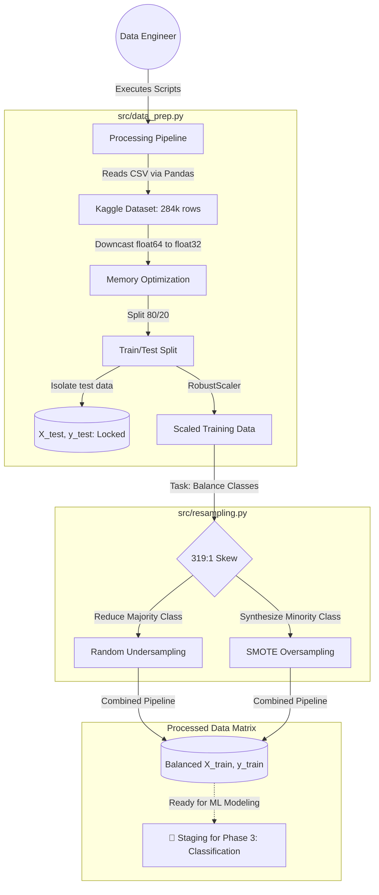

# Credit Card Fraud Detection: Resampling & Processing Engine
> *This repository is currently under active development. The data ingestion and resampling pipelines are complete, and we are currently staging for the machine learning modeling phase.*

A modular, memory-efficient Python pipeline engineered to process and balance highly skewed financial datasets. Designed specifically for low-resource hardware constraints, this project implements robust data ingestion, feature scaling, and advanced algorithmic resampling techniques (SMOTE & Undersampling) to prepare raw Kaggle credit card transaction data for future machine learning classification.

---
## 📅 Project Roadmap
This project is being built progressively to ensure high code quality and mathematical rigor at each step.

* [x] **Day 1: System Architecture & Ingestion** — Structuring the repository, optimizing memory usage (`float64` to `float32`), and implementing leakage-proof Train/Test splits.
* [x] **Day 2: The Equalizer (Current)** — Handling the 319:1 class imbalance using Imbalanced-Learn pipelines (Targeted Undersampling + SMOTE).
* [ ] **Day 3: Baseline Modeling** — Building and testing Logistic Regression and Random Forest classifiers.
* [ ] **Day 4: Evaluation & Tuning** — Hyperparameter tuning via Randomized Search and generating Precision-Recall matrices.
* [ ] **Day 5: Orchestration & Deployment** — Finalizing the `main.py` pipeline and deploying the saved `.joblib` model via a lightweight API.

---
## 🔗 System Components
* 💾 **[Data Prep Module](src/data_prep.py)**: Memory-optimized data loader, train/test allocator, and outlier-resistant feature scaler.
* ⚖️ **[Resampling Module](src/resampling.py)**: Mathematical class equalizer utilizing synthetic generation and targeted downsampling.
* 📦 **[Requirements](requirements.txt)**: Strict dependency tracker ensuring environment reproducibility.

---
## 🏗️ System Architecture Flow (Current State)



---

## ✨ Key Features (Implemented)

* **Memory-Optimized Ingestion:** Programmatically downcasts natively heavy 64-bit float arrays to 32-bit and 8-bit integers, effectively cutting RAM consumption in half to support laptop-grade computation.
* **Leakage-Proof Architecture:** Enforces strict strict separation of training and testing data matrices *prior* to any scaling or resampling, completely preventing future target leakage.
* **Outlier-Resistant Scaling:** Applies Scikit-Learn's `RobustScaler` to raw transactional amounts and timeframes, relying on interquartile ranges rather than standard means to neutralize extreme financial anomalies.
* **Hybrid Resampling Strategy:** Combines targeted deletion of majority "Normal" transactions with SMOTE (Synthetic Minority Over-sampling Technique) to map and artificially generate highly realistic "Fraud" points, perfectly balancing a dataset previously skewed at 319:1.

---

## 🛠️ Tech Stack

* **Language:** Python 3.x
* **Numerical Processing:** NumPy (Vectorized matrix operations)
* **Data Manipulation:** Pandas (High-performance CSV I/O and memory management)
* **Preprocessing Suite:** Scikit-Learn (Train/test splitting and robust feature scaling)
* **Class Balancing:** Imbalanced-Learn (SMOTE generation and algorithmic undersampling)

---

## 🚀 Getting Started

**1. Clone the repository:**

```bash
git clone <your-repository-url>
cd FRAUD-DETECTION

```

**2. Configure Environment & Dependencies:**
Ensure you have a virtual environment (`.venv`) activated, then install the required foundational libraries:

```bash
pip install -r requirements.txt

```

**3. Acquire the Raw Data:**
Download the "Credit Card Fraud Detection" dataset from Kaggle and place `creditcard.csv` directly into the `data/raw/` directory.

**4. Run Commands (CLI Execution):**

*Task 1 - Memory-Efficient Data Loading & Scaling:*

```bash
python src/data_prep.py

```

*Task 2 - Class Balancing (SMOTE & Undersampling):*

```bash
python src/resampling.py

```